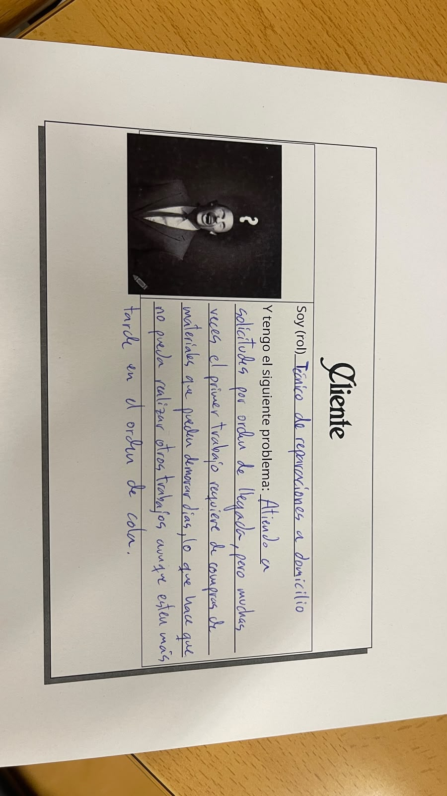

# GestionColaReparaciones

Mi padre es autónomo, técnico de reparaciones y mantenimiento del hogar. Atiende las solicitudes de sus clientes por orden de llegada, pero muchas veces el primer trabajo de la lista requiere que antes compre algún material o algun inconveniente por el estilo, así que no puede empezarlo enseguida. Mientras tanto, podría estar haciendo otros trabajos que ya tiene pendientes y que no necesitan nada especial, pero al seguir el orden de llegada los deja esperando y pierde tiempo en el que podría estar trabajando. Necesita poder ver y actualizar la informacion en todo momento incluso fuera de casa o desde varios dispositivos distintos. El tiene que poder decidir que especificaciones requiere cada tarea segun la descripcion que le dan los clientes del trabajo a realizar, ya sea tipo de trabajo, necesidad de material, tiempo estimado, etc

## Configuración del repositorio seguido de: [Ver documentación de configuración](docs/configuracion/configuracion.md)