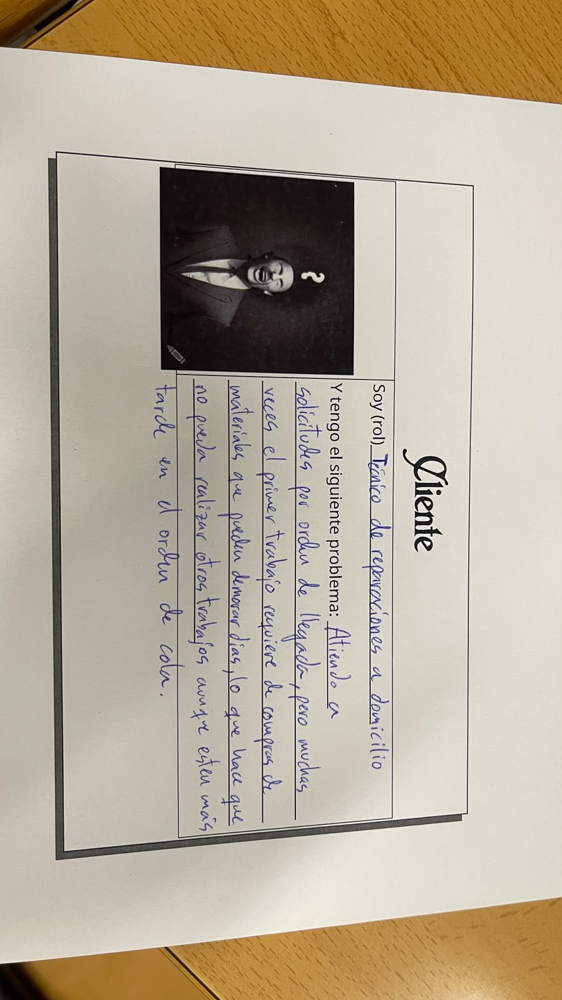

# GestionColaReparaciones

Mi padre tiene un trabajo de mañana y por la tarde o en los fines de semana trabaja de autónomo, técnico de reparaciones y mantenimiento del hogar. El problema surge en la parte del trabajo autónomo. Apunta los trabajos pendientes en notas, WhatsApp y básicamente donde le pille y el orden lo lleva más o menos de memoria. Solo acepta solicitudes que pueda empezar como máximo en una semana aproximadamente (la semana es para completar el resto de trabajos pendientes), si no, las rechaza. Atiende las solicitudes de sus clientes por orden de llegada, pero muchas veces el primer trabajo de la lista requiere que antes compre algún material o algún inconveniente por el estilo (esto también lo intenta apuntar), así que no puede empezarlo enseguida. Mientras tanto podría estar haciendo otros trabajos que ya tiene pendientes y que no necesitan nada especial, pero al estar todo desorganizado se limita a seguir el orden de llegada. Así, los deja esperando y pierde tiempo en el que podría estar acabando otros trabajos y por ende, permitirse aceptar más solicitudes. A esto se suma que en mitad de un trabajo también pueden surgir esos inconvenientes y tener que aplazarlo, y no lo quiere poner al final de la cola y a su vez le resulta difícil organizarlo para que no se solape con otro o no tener que retrasar todos los demás trabajos.

## Datos

Para conocer y medir el problema, los datos los apuntará mi padre (o yo con la información que me proporcione) en una hoja de Google Sheets en la que anotará los trabajos aceptados y rechazados.

### Por cada trabajo aceptado anotará:

| ¿Qué hay que hacer? | Fecha que llamó |	¿Necesita material?	| Fecha prevista del material |	Fecha que tuvo el material | Fecha que empezó | Fecha que terminó	| ¿Se aplazó a mitad? |	Notas |
|---|---|---|---|---|---|---|---|---|

### Por cada trabajo rechazado anotará:

| Fecha que llamó	| Qué pedía |	Por qué lo rechazó |	Notas |
|---|---|---|---|

## Medición de Mejora

Hay un apartado en el que se recogen las estadísticas. A partir de todos los apartados mediremos como mejora reducir las solicitudes rechazadas por tener la semana llena y reducir los días de trabajos parados esperando material.

## Configuración del repositorio: [Ver documentación de configuración](docs/configuracion/configuracion.md)
