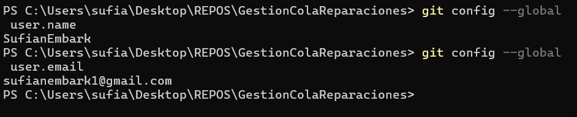
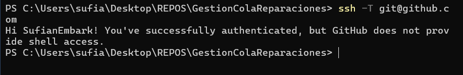
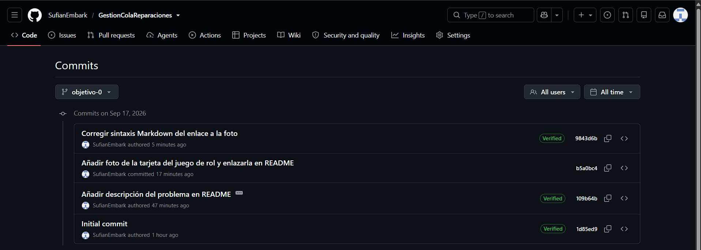

# Configuración del repositorio

Documentación de la configuración de git y SSH realizada para este proyecto.

## Configuración de nombre y email en git

## Verificación de conexión SSH con GitHub

## Clave SSH generada y subida a GitHub

## Historial de commits verificados

